## Introduction

Gross Domestic Product (GDP) is the total monetary or market value of all the finished goods and services produced within a country's borders in a specific time period. As a broad measure of overall domestic production, it functions as a comprehensive scorecard of the country’s economic health.

Military expenditure is the expenditure by a country's government on their military forces, i.e. maintenance and operations, military research and development, Military aid, procurement, salaries, pensions, etc. World military spending refers to the aggregate global military spending by different countries - analysis of this data can help understand the status of a particular country as a military power in the world arena.

We will analyze military expenditure of 10 countries and their Gross Domestic Product (GDP). We additionally want to find trends and draw conclusions.

## Comparing Military Expenditure and GDP:

We will compare Military Expenditure and GDP from 2014 to 2018 for the following 10 countries:

a. China:

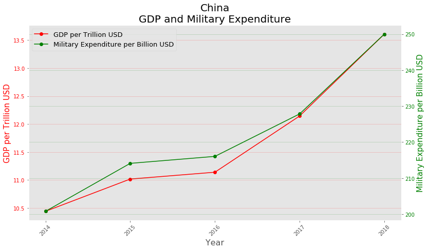

China's GDP and military expenditure follow a very closely related pattern and there is an increasing trend for GDP and Military Expenditure.

b. France

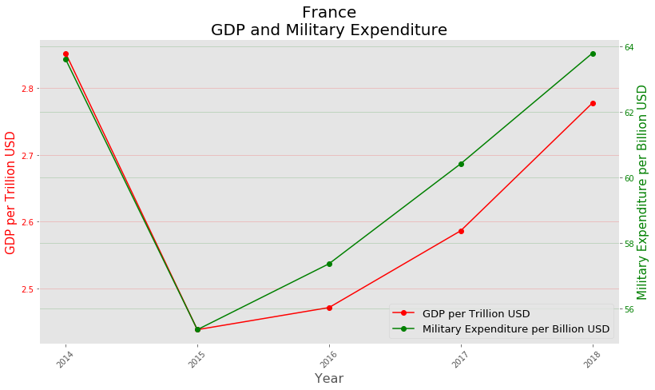

France's GDP and military expenditure too follow a closely related pattern. There is a drop in GDP and military expenditure from 2014 to 2015 but then we observe an increasing trend from 2015 onwards.

c. Germany

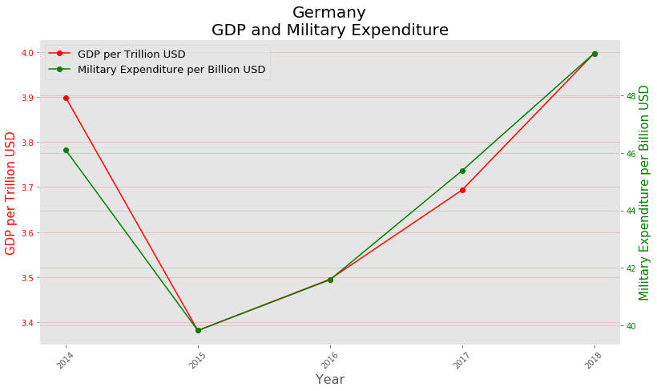

Germany's GDP and military expenditure also follow a closely related pattern. There is a drop in GDP and military expenditure from 2014 to 2015 but then we observe an increasing trend from 2015 onwards.

d. Israel

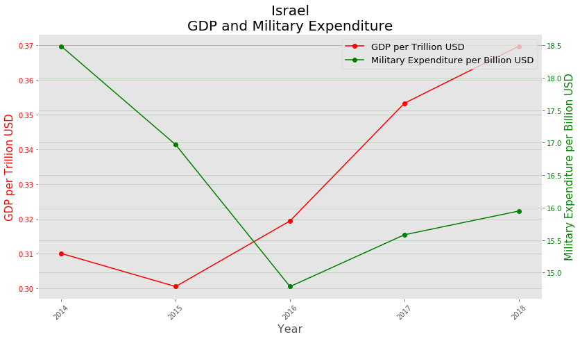

For Israel we notice that in the year 2016, its military expenditure decreased, but its GDP increased.

e. Italy

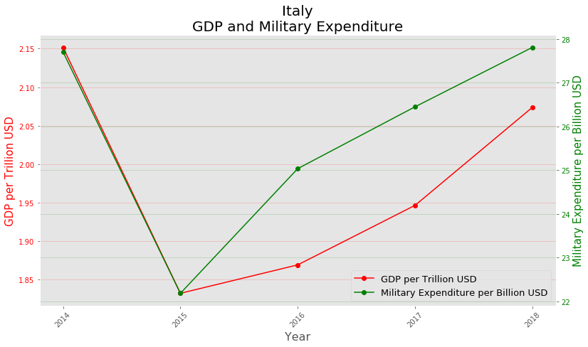

For Italy, we notice that the GDP and Military Expenditure was lowest in the year 2015, a possible reason for this could be the Great Recession which caused Italy's debt to be at all time high.

f. Russian Federation

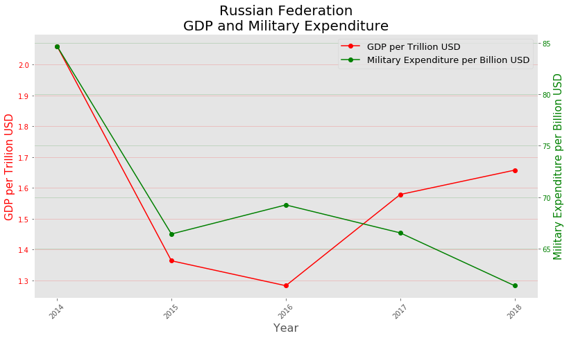

For Russian Federation we notice that the GDP and Military Expenditure is steadily decreasing, this could be due to the Russian Financial Crisis.

g. Saudi Arabia

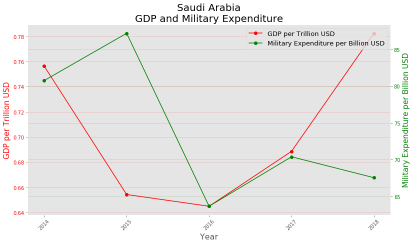

For Saudi Arabia in the year 2015, its Military Expenditure was very high, a possible reason could be that Saudi Arabia was in a War with its neighboring country Yemen in this period.

h. South Korea

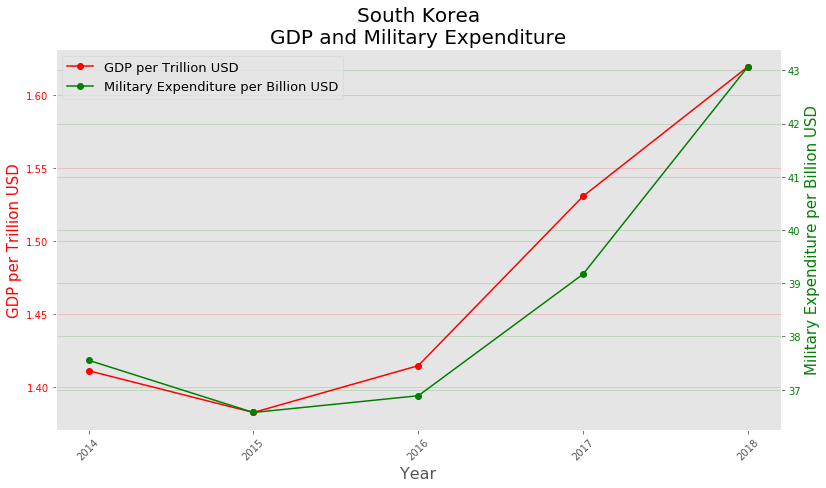

South Korea's GDP and Military Expenditure are closely related and have an increasing trend.

i. United Kingdom

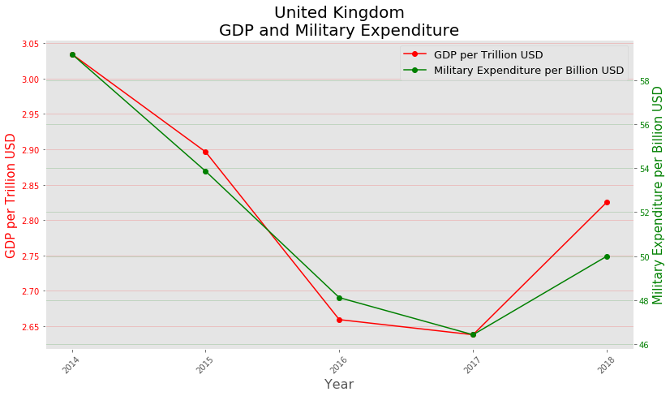

United Kingdom's GDP and Military Expenditure are closely related and have an decreasing trend.

j. United States

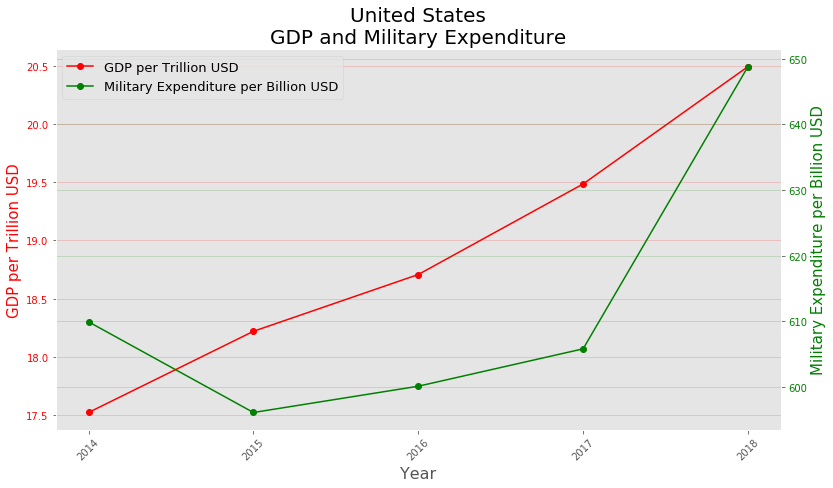

United States has a steady increase in it's GDP through the years.

## Comparing Overall Military Expenditure by Country:

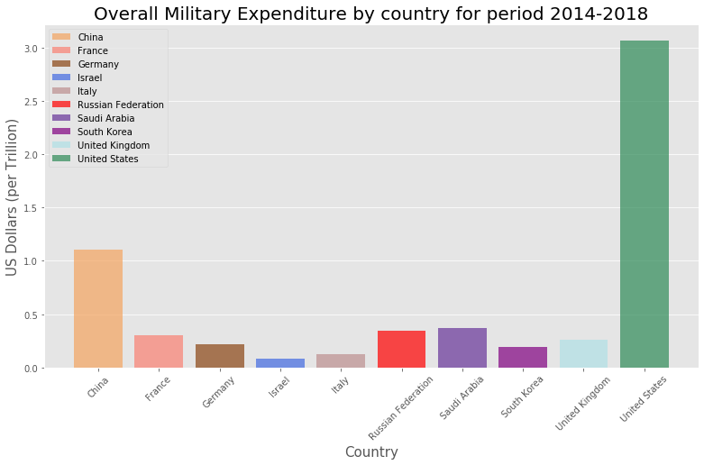

## Comparing Overall Military Expenditure by Country (in percentages):

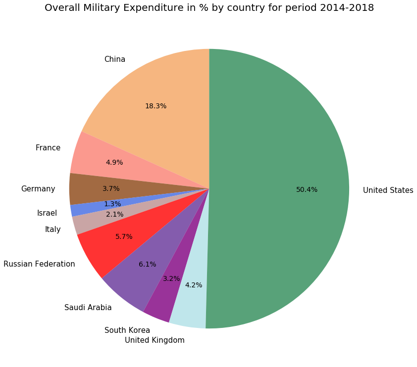

## Comparing GDP per person and Military Expenditure per person:

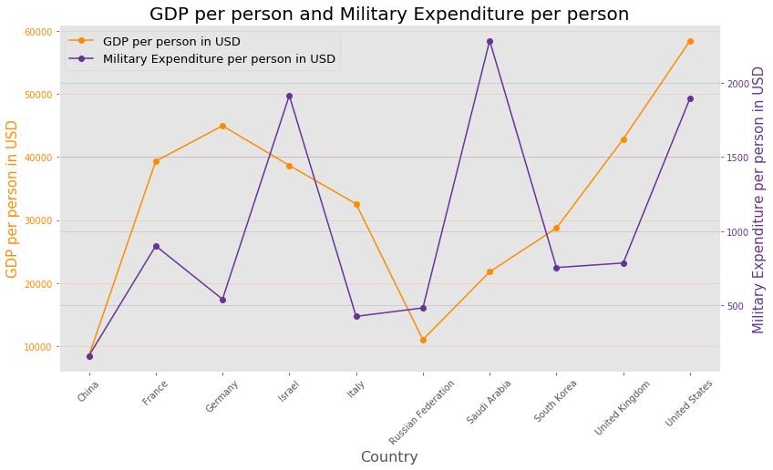

## Military Expenditure as a Share of GDP:

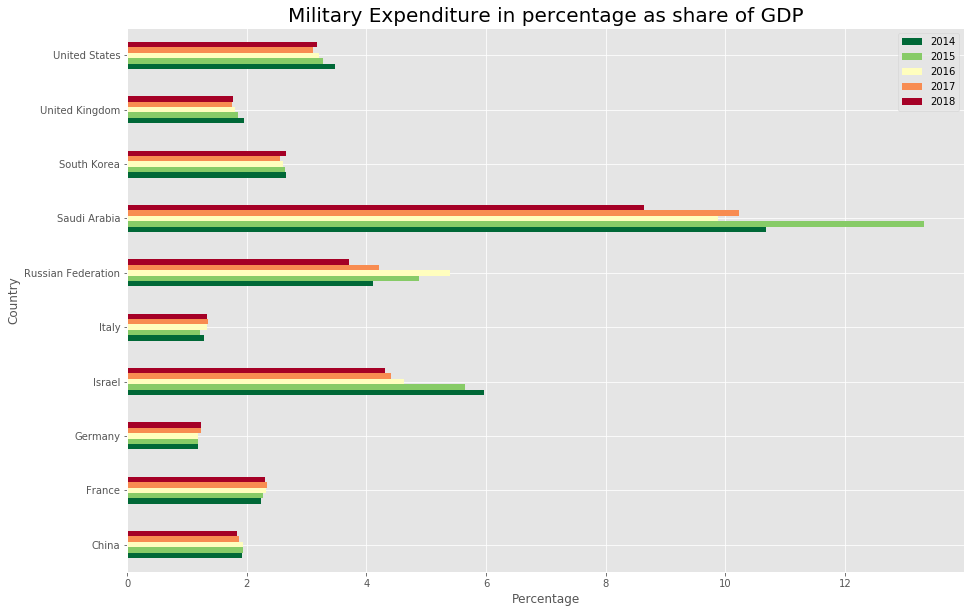

## Military Expenditure difference in absolute values:

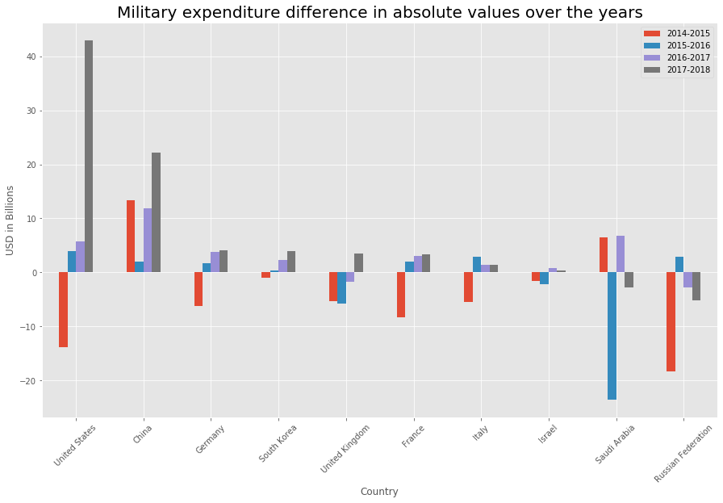

## Military Expenditure difference in percentages:

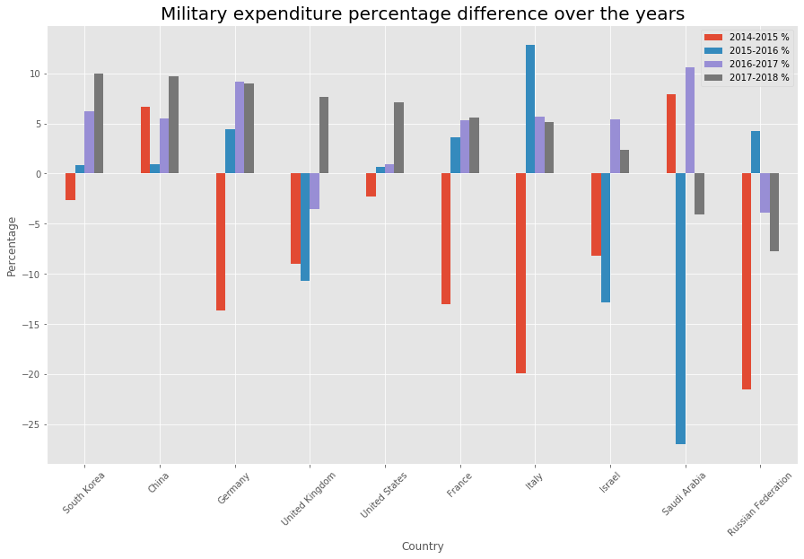

## Conclusion

------------------------

Check the following link for video explanation:

[Link to Jupyter Notebook](https://github.com/sheldonsebastian/Military-Expenditure/blob/master/Military%20Expenditure%20Analysis.ipynb)
